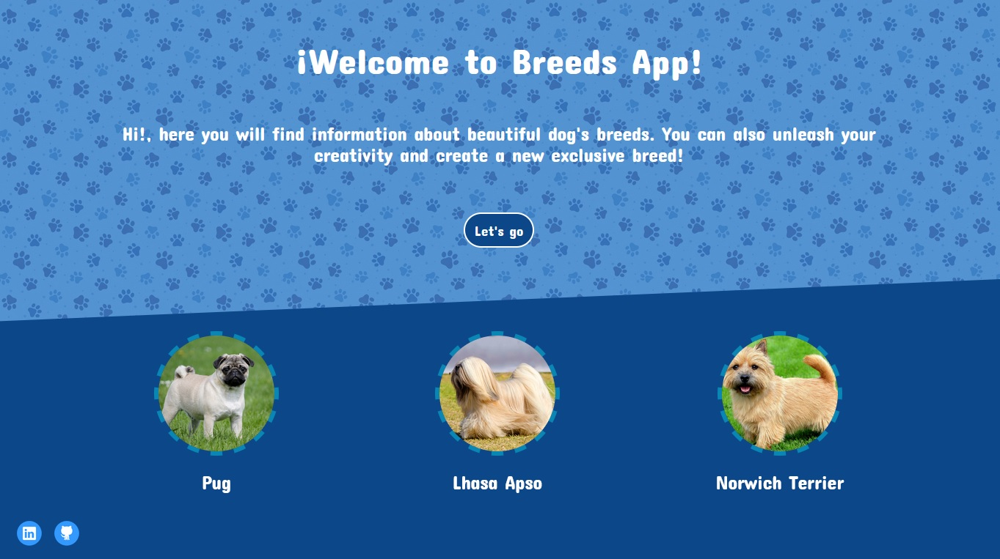
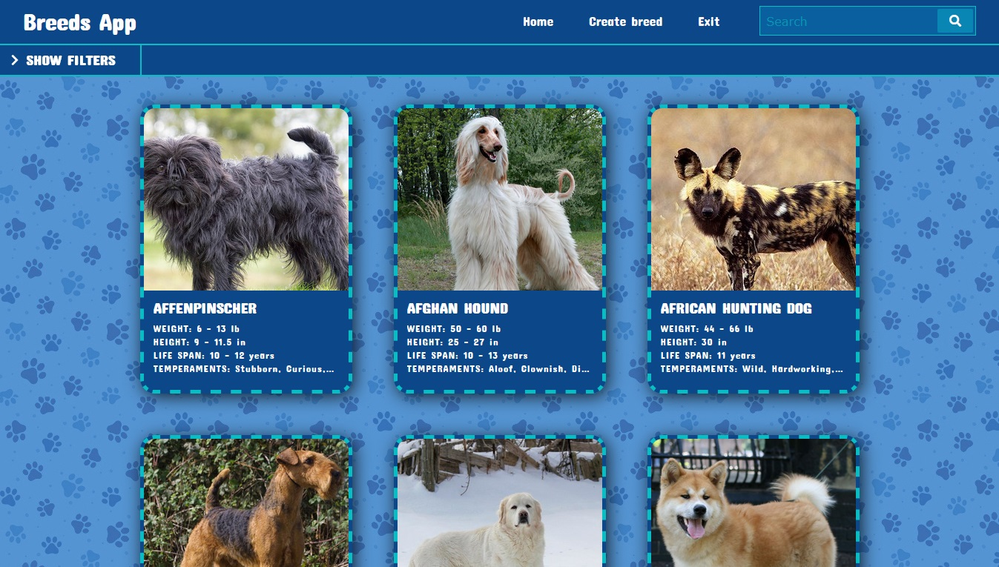
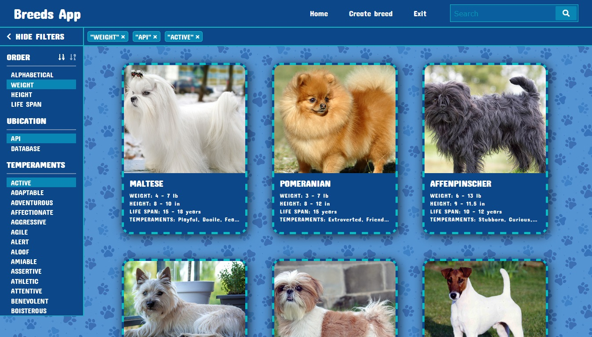
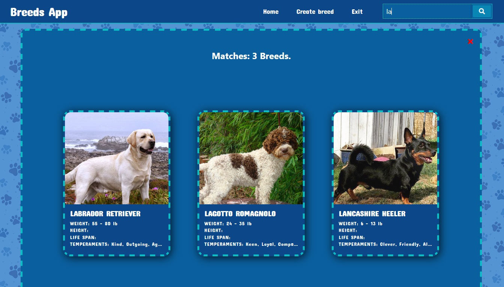
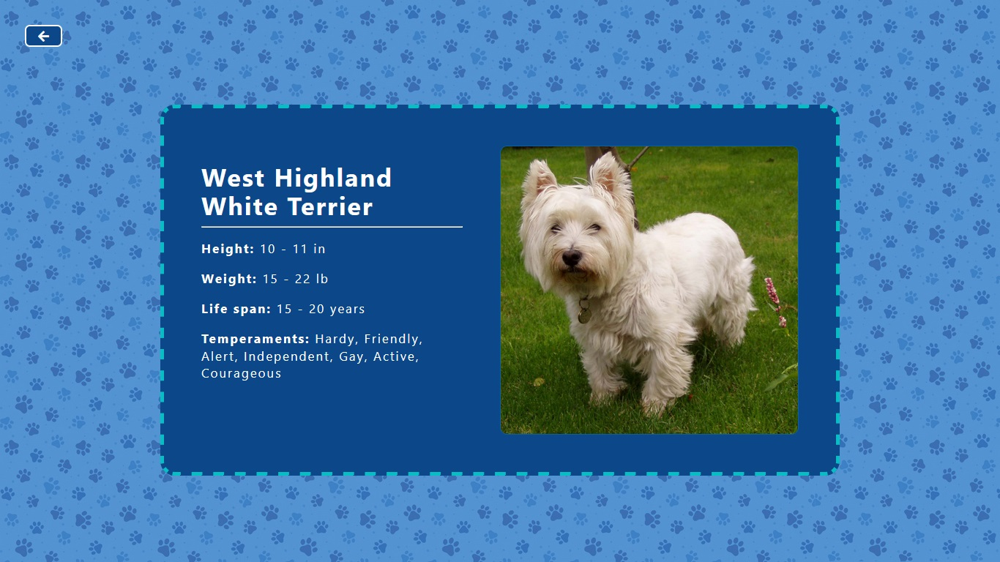
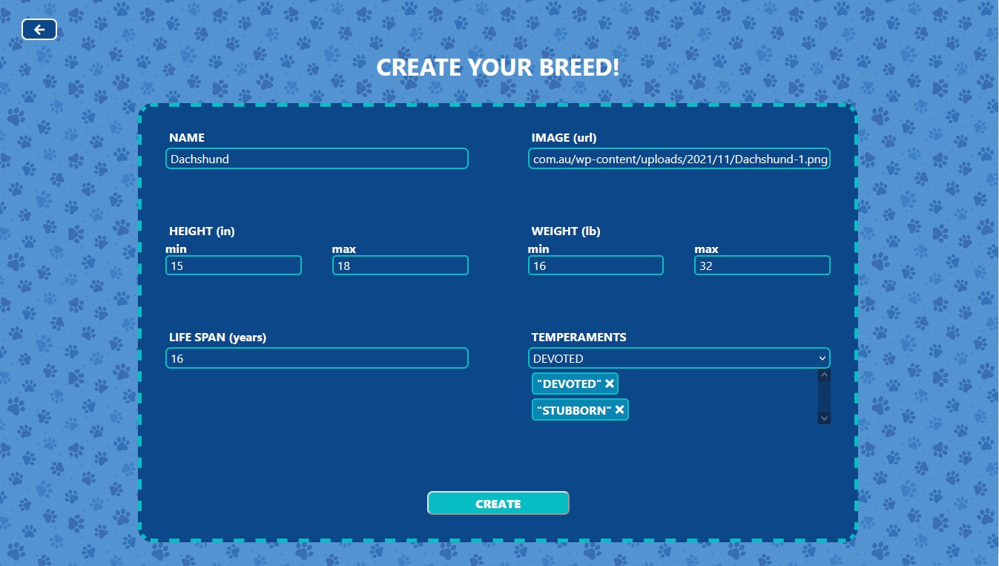
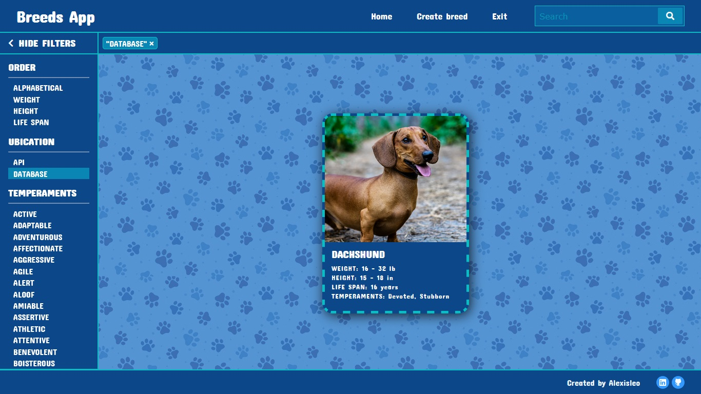

# Countries App

Esta es una aplicación web (SPA) que ofrece información sobre razas de perros, aprovechando herramientas como React, Redux, Express, Sequelize y Postgres para brindar una experiencia fluida y amigable.

La idea general consistió en crear una aplicación en la cual se puedan ver distintas razas de perro junto con información relevante de las mismas utilizando la api externa [the dog api](https://thedogapi.com/) y a partir de ella poder, entre otras cosas:

  - Buscar perros
  - Filtrarlos / Ordenarlos
  - Agregar nuevos perros

## Frontend

En el desarrollo Frontend de la aplicación, se emplearon tecnologías como React y Redux.

## Capturas de Pantalla

A continuación, te presento algunas capturas de pantalla que te dan una idea visual de las características más destacadas de la aplicación:

**Landing Page:**


**Home:**


**Filtros:**


**Busqueda:**


**Detalles de cada raza:**


**Formulario para crear una tarjeta de raza:**


**Tarjeta de raza creada:**


### Iniciar la Aplicación desde el lado del Frontend:

Si deseas ejecutar la aplicación en tu entorno local, sigue estos sencillos pasos:

1. Navega hasta la carpeta principal del cliente:
   ```bash
   cd client
   ```

2. Instala las dependencias de la aplicación utilizando npm:
   ```bash
   npm install
   ```

3. Inicia la aplicación en modo de desarrollo:
   ```bash
   npm start
   ```

4. Abre tu navegador web y visita http://localhost:3000 para explorar la aplicación.

## Backend

La sección de backend de la aplicación está basada en tecnologías como Node y Express, y se implementan las siguientes rutas esenciales:

- [x] __GET /dogs__:
  - Retorna un listado de las razas de perro

- [x] __GET /dogs?name="..."__:
  - Retorna un listado de las razas de perro que contengan la palabra ingresada como query param.

- [x] __GET /dogs/{idRaza}__:
  - Retorna el detalle de una raza de perro en particular.

- [x] __GET /temperament__:
  - Retorna todos los temperamentos posibles.

- [x] __POST /dog__:
  - Recibe los datos recolectados desde el formulario controlado de la ruta de creación de raza de perro por body.
  - Crea una raza de perro en la base de datos

### Iniciar la Aplicación desde el lado del Backend:

Si tienes curiosidad y quieres probar la aplicación en tu propio entorno, sigue estos pasos:

1. Dirígete a la carpeta principal del servidor:
   ```bash
   cd api
   ```

2. Instala las dependencias de la aplicación utilizando npm:
   ```bash
   npm install
   ```

3. Renombra el archivo ``.env.template`` a ``.env`` y reemplaza los valores de las variables correspondientes. 

4. Inicia la aplicación en modo de desarrollo:
   ```bash
   npm start
   ```

4. Abre tu navegador web y visita http://localhost:PORT para explorar la aplicación.
